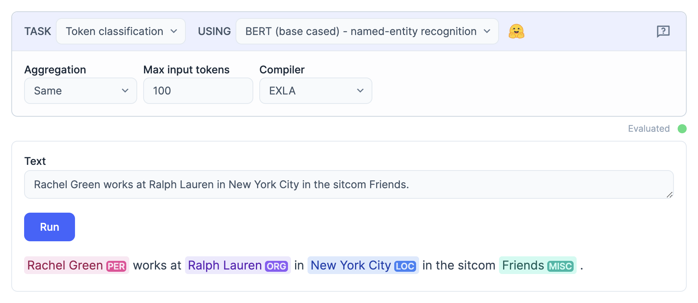
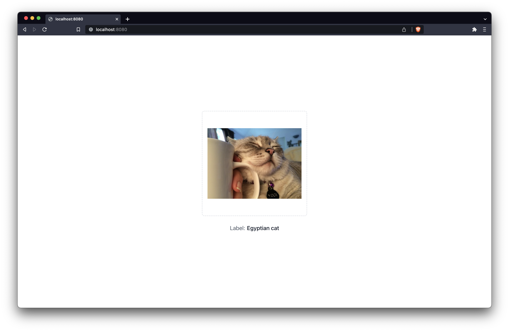

# Bumblebee

[](https://hexdocs.pm/bumblebee)
[](https://github.com/elixir-nx/bumblebee/actions)

Bumblebee provides pre-trained Neural Network models on top of [Axon](https://github.com/elixir-nx/axon). It includes integration with [🤗 Models](https://huggingface.co/models), allowing anyone to download and perform Machine Learning tasks with few lines of code.


## Getting started

The best way to get started with Bumblebee is with [Livebook](https://livebook.dev). [Our announcement video](https://news.livebook.dev/announcing-bumblebee-gpt2-stable-diffusion-and-more-in-elixir-3Op73O) shows how to use Livebook's Smart Cells to perform different Neural Network tasks with few clicks. You can then tweak the code and deploy it.



We also provide single-file examples of running Neural Networks inside your Phoenix (+ LiveView) apps inside the [examples/phoenix](examples/phoenix) folder.



You may also check [our official docs](https://hexdocs.pm/bumblebee), which includes notebooks and our API reference. The "Tasks" section in the sidebar covers high-level APIs for using Bumblebee. The remaining modules in the sidebar lists all supported architectures.

## Installation

First add Bumblebee and EXLA as dependencies in your `mix.exs`. EXLA is an optional dependency but an important one as it allows you to compile models just-in-time and run them on CPU/GPU:

```elixir
def deps do
  [
    {:bumblebee, "~> 0.6.0"},
    {:exla, ">= 0.0.0"}
  ]
end
```

Then configure `Nx` to use EXLA backend by default in your `config/config.exs` file:

```elixir
import Config

config :nx, default_backend: EXLA.Backend
```

To use GPUs, you must [set the `XLA_TARGET` environment variable accordingly](https://github.com/elixir-nx/xla#usage).

In notebooks and scripts, use the following `Mix.install/2` call to both install and configure dependencies:

```elixir
Mix.install(
  [
    {:bumblebee, "~> 0.6.0"},
    {:exla, ">= 0.0.0"}
  ],
  config: [nx: [default_backend: EXLA.Backend]]
)
```

## Usage

To get a sense of what Bumblebee does, look at this example:

```elixir
{:ok, model_info} = Bumblebee.load_model({:hf, "google-bert/bert-base-uncased"})
{:ok, tokenizer} = Bumblebee.load_tokenizer({:hf, "google-bert/bert-base-uncased"})

serving = Bumblebee.Text.fill_mask(model_info, tokenizer)
Nx.Serving.run(serving, "The capital of [MASK] is Paris.")
#=> %{
#=>   predictions: [
#=>     %{score: 0.9279842972755432, token: "france"},
#=>     %{score: 0.008412551134824753, token: "brittany"},
#=>     %{score: 0.007433671969920397, token: "algeria"},
#=>     %{score: 0.004957548808306456, token: "department"},
#=>     %{score: 0.004369721747934818, token: "reunion"}
#=>   ]
#=> }
```

We load the BERT model from Hugging Face Hub, then plug it into an end-to-end pipeline in the form of "serving", finally we use the serving to get our task done. For more details check out [the documentation](https://hexdocs.pm/bumblebee).

<!-- Docs -->

## HuggingFace Hub

HuggingFace Hub is a platform hosting models, datasets and demo apps (Spaces), all using Git repositories (with Git LFS for large files). For further information check out the [Hub documentation](https://huggingface.co/docs/hub/index) and explore the [model repositories](https://huggingface.co/models).

### Models

Model repositories are regular Git repositories, therefore they can store arbitrary files. However, most repositories store models saved using the Python [Transformers](https://github.com/huggingface/transformers) library. Bumblebee is an Elixir counterpart of Transformers and allows for importing those models, as long as they are implemented in Bumblebee.

A repository in the Transformers format does not store an actual model, only the trained parameters and a configuration file. The configuration file specifies the model type (e.g. BERT) and high-level properties, such as the number layers and their size. The model implementation lives in the library code (both Transformers and Bumblebee). When loading a model, the library fetches the configuration and builds a matching model, then it fetches the trained parameters to pair them with the model. The key takeaway is that in order to use any given model, it needs to have an implementation in Bumblebee.

### Model repository

Here is a list of files commonly found in a repository following the Transformers format.

- `config.json` - model configuration, specifies the model type and model-specific options. You can think of this as a blueprint for how the model should be constructed

- `pytorch_model.bin` - raw model parameters (tensors) serialized from a PyTorch model using [PyTorch format](https://pytorch.org/docs/stable/generated/torch.save.html) (supported by Bumblebee)

- `model.safetensors` - raw model parameters (tensors) serialized from a PyTorch model using [Safetensors](https://github.com/huggingface/safetensors) (supported by Bumblebee)

- `flax_model.msgpack`, `tf_model.h5` - raw model parameters (tensors) serialized from Flax and Tensorflow models respectively (not supported by Bumblebee)

- `tokenizer.json`, `tokenizer_config.json` - tokenizer configuration, describes how to convert text input to model inputs (tensors). See [Tokenizer support](#tokenizer-support)

- `preprocessor_config.json` - featurizer configuration, describes how to convert real-world input (image, audio) to model inputs (tensors)

- `generation_config.json` - a set of configuration options specific to text generation, such as token sampling strategy and various constraints

### Model support

As pointed out above, in order to load a model, the given model type must be implemented in Bumblebee. To find out whether the model is supported you can call `Bumblebee.load_model({:hf, "model-repo"})` or use [this tool](https://jonatanklosko-bumblebee-tools.hf.space/apps/repository-inspector) to run a number of checks against the repository.

If you prefer to poke around the code, open the `config.json` file in the model repository and copy the class name under `"architectures"`. Next, [search Bumblebee codebase](https://github.com/search?q=repo%3Aelixir-nx%2Fbumblebee+BertForMaskedLM&type=code) for that keyword. If you find a match, this indicates the model is supported.

Also note that certain repositories include multiple models in separate repositories, for example [`stabilityai/stable-diffusion-2`](https://huggingface.co/stabilityai/stable-diffusion-2). In such case use `Bumblebee.load_model({:hf, "model-repo", subdir: "..."})`.

### Tokenizer support

The Transformers library distinguishes two types of tokenizer implementations:

- "slow tokenizer" - a tokenizer implemented in Python and stored as `tokenizer_config.json` and a couple extra files

- "fast tokenizer" - a tokenizer implemented in Rust and stored in a single file - `tokenizer.json`

Bumblebee relies on the Rust implementations (through bindings to [Tokenizers](https://github.com/huggingface/tokenizers)) and therefore always requires the `tokenizer.json` file. Many repositories only include files for a "slow tokenizer". When you stumble upon such repository, there are two options you can try.

First, if the repository is clearly a fine-tuned version of another model, you can look for `tokenizer.json` in the original model repository. For example, [`textattack/bert-base-uncased-yelp-polarity`](https://huggingface.co/textattack/bert-base-uncased-yelp-polarity) only includes `tokenizer_config.json`, but it is a fine-tuned version of [`bert-base-uncased`](https://huggingface.co/bert-base-uncased), which does include `tokenizer.json`. Consequently, you can safely load the model from `textattack/bert-base-uncased-yelp-polarity` and tokenizer from `bert-base-uncased`.

Otherwise, the Transformers library includes conversion rules to load a "slow tokenizer" and convert it to a corresponding "fast tokenizer", which is possible in most cases. You can generate the `tokenizer.json` file using [this tool](https://jonatanklosko-bumblebee-tools.hf.space/apps/tokenizer-generator). Once successful, you can follow the steps to submit a PR adding `tokenizer.json` to the model repository. Note that you do not have to wait for the PR to be merged, instead you can copy commit SHA from the PR and load the tokenizer with `Bumblebee.load_tokenizer({:hf, "model-repo", revision: "..."})`.

## Global configuration

You can configure the progress bar displayed during model downloads:

```elixir
# Update every 10% instead of every 1%
config :bumblebee, :progress_bar_step, 10

# Disable progress bar entirely
config :bumblebee, :progress_bar_enabled, false
```

<!-- Docs -->

## Contributing

> **Note on AI usage**
>
> If you contribute a model implementation using a coding agent, you are still expected to read, understand and verify the model implementation, such that you are able to answer questions during code review. If the majority of the code is LLM-generated, contributors are expected to disclose that fact.

We welcome contributions of new models to the project.

For reference, you can look at an example complete PR adding SmolLM3 LLM [here](https://github.com/elixir-nx/bumblebee/pull/422/files), and another one adding Swin image classification model [here](https://github.com/elixir-nx/bumblebee/pull/394/files).

The main steps of adding a new model are the following:

1. Find the Python implementation and configuration files for the model in the `huggingface/transformers` project, for example [modeling_smollm3.py](https://github.com/huggingface/transformers/blob/v5.0.0rc1/src/transformers/models/smollm3/modeling_smollm3.py) and [configuration_smollm3.py](https://github.com/huggingface/transformers/blob/v5.0.0rc1/src/transformers/models/smollm3/configuration_smollm3.py).

2. Look at some existing model implementations in Bumblebee. In case of LLMs, copying an existing LLM implementation is typically a good starting point.

3. Implement the model code.
   - Whenever possible, reuse existing primitives, most notably `Layers.Transformer.blocks/2`, which is shared for most LLM implementations. Sometimes models introduce novelties to the transformer design, in which case it may be necessary to add a new option to `Layers.Transformer.blocks/2`.
   - Include relevant options from Python model configuration as Bumblebee model options (with matching defaults).
   - Make sure the `params_mapping/1` maps to correct Python layer names. You can use `Bumblebee.load_model(..., log_params_diff: true)` to get all logs related to params loading.

4. Add tests for each of the model architectures. Look at existing tests for reference. The tests should verify a slice of model output matches **reference values obtained from running the Python model**. The values can be obtained using a Python script like this:

   ```python
   from transformers import BertModel
   import torch

   model = BertModel.from_pretrained("hf-internal-testing/tiny-random-BertModel")

   inputs = {
     "input_ids": torch.tensor([[10, 20, 30, 40, 50, 60, 70, 80, 0, 0]]),
     "attention_mask": torch.tensor([[1, 1, 1, 1, 1, 1, 1, 1, 0, 0]])
   }

   outputs = model(**inputs)

   print(outputs.last_hidden_state.shape)
   print(outputs.last_hidden_state[:, 1:4, 1:4])

   #=> torch.Size([1, 10, 32])
   #=> tensor([[[-0.2331,  1.7817,  1.1736],
   #=>          [-1.1001,  1.3922, -0.3391],
   #=>          [ 0.0408,  0.8677, -0.0779]]], grad_fn=<SliceBackward0>)
   ```

   For the tests, try finding model repositories in the [hf-internal-testing](https://huggingface.co/hf-internal-testing) organization. If there is no repository for the given model, you can use any other repository or local checkpoint - once you open the PR we will create a repository under [bumblebee-testing](https://huggingface.co/bumblebee-testing). To generate a checkpoint locally, you can use a Python script like this:

   ```python
   from transformers import SmolLM3Config, SmolLM3Model, SmolLM3ForCausalLM, SmolLM3ForQuestionAnswering, SmolLM3ForSequenceClassification, SmolLM3ForTokenClassification

   config = SmolLM3Config(
     vocab_size=1024,
     hidden_size=32,
     num_hidden_layers=2,
     num_attention_heads=4,
     intermediate_size=37,
     hidden_act="gelu",
     hidden_dropout_prob=0.1,
     attention_probs_dropout_prob=0.1,
     max_position_embeddings=512,
     type_vocab_size=16,
     is_decoder=False,
     initializer_range=0.02,
     pad_token_id=0,
     no_rope_layers=[0, 1]
   )

   for c in [SmolLM3Model, SmolLM3ForCausalLM, SmolLM3ForQuestionAnswering, SmolLM3ForSequenceClassification, SmolLM3ForTokenClassification]:
     name = c.__name__
     c(config).save_pretrained(f"bumblebee-testing/tiny-random-{name}", repo_id=f"bumblebee-testing/tiny-random-{name}")
   ```

   You may need to adjust the configuration for the new model accordingly.

5. If the model uses a new type of tokenizer, you may need to add a new tokenizer mapping to `@tokenizer_types` in `lib/bumblebee/text/pre_trained_tokenizer.ex`, and a corresponding test in `test/bumblebee/text/pre_trained_tokenizer_test.exs`.

6. Finally, it is highly advisable to try the model end-to-end with a real-world model checkpoint from [HuggingFace Hub](https://huggingface.co/models), to make sure it produces expected output. Given that models can have different configuration, it is possible to miss some relevant code path or option when testing solely against a tiny-random checkpoint.

## License

    Copyright (c) 2022 Dashbit

    Licensed under the Apache License, Version 2.0 (the "License");
    you may not use this file except in compliance with the License.
    You may obtain a copy of the License at [http://www.apache.org/licenses/LICENSE-2.0](http://www.apache.org/licenses/LICENSE-2.0)

    Unless required by applicable law or agreed to in writing, software
    distributed under the License is distributed on an "AS IS" BASIS,
    WITHOUT WARRANTIES OR CONDITIONS OF ANY KIND, either express or implied.
    See the License for the specific language governing permissions and
    limitations under the License.
